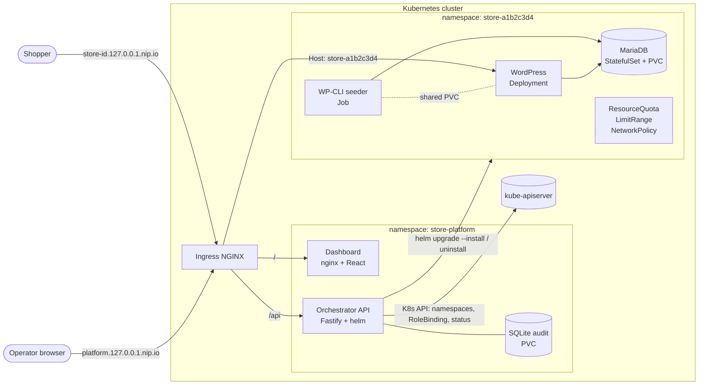
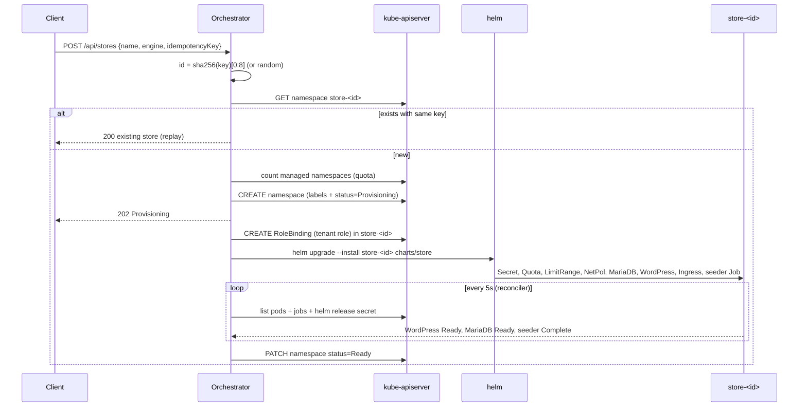

# System Design

## 1. Goals

- Provision an isolated, working e-commerce store on Kubernetes with one API call.
- Run identically on a laptop (Kind) and a VPS (k3s); only Helm values differ.
- Survive orchestrator crashes, retries and duplicate requests without leaking or duplicating resources.
- Keep each tenant contained: CPU, memory, storage, network and credentials.

## 2. Architecture



ASCII version:

```
             ┌──────────────────────── Ingress NGINX (host routing) ───────────────────────┐
             │ platform.<domain>/      platform.<domain>/api       store-<id>.<domain>/     │
             └──────┬─────────────────────────┬───────────────────────────┬────────────────┘
                    ▼                         ▼                           ▼
             ┌────────────┐          ┌─────────────────┐       ┌──────────── store-<id> ────────────┐
             │ Dashboard  │  fetch   │ Orchestrator API │ helm  │ WordPress ─► MariaDB (PVC)          │
             │ React/nginx│ ───────► │ Fastify          │ ────► │ WP-CLI seeder Job (shared WP PVC)   │
             └────────────┘          │  ├ StoreManager  │       │ Quota · LimitRange · NetworkPolicy  │
                                     │  ├ Reconciler    │ watch │ Secret (generated credentials)      │
                                     │  └ Audit (SQLite)│ ◄──── │ Ingress store-<id>.<domain>         │
                                     └─────────────────┘       └─────────────────────────────────────┘
```

### Components

| Component | Responsibility |
|-----------|----------------|
| `charts/platform` | API Deployment, dashboard Deployment, Services, Ingress, ServiceAccount, RBAC, ValidatingAdmissionPolicy, ConfigMap. |
| `charts/store` | Everything one tenant needs. Installed once per store as release `store-<id>` in namespace `store-<id>`. |
| Orchestrator API | Validates requests, enforces platform quota and idempotency, creates the namespace and tenant RoleBinding, runs Helm, reconciles status, records the audit log. |
| Engine providers | `WooCommerceEngineProvider` (fully implemented) and `MedusaEngineProvider` (interface only). An engine knows how to install, judge health of, and remove its own workloads; everything else is platform logic. |
| Dashboard | Polls every 5 s. Create, delete with confirmation, status badges with failure reasons, activity drawer. |

### Provisioning sequence



## 3. Multi-tenant isolation

Every store is a namespace. Tenancy controls are part of the store chart, so a store cannot exist without them.

| Layer | Control | Setting (prod) |
|-------|---------|----------------|
| Naming | Namespace `store-<id>`, release `store-<id>` | id is 8 chars `[a-z0-9]` |
| Compute | `ResourceQuota` | requests 500m CPU / 512Mi, limits 1500m / 1536Mi, 2 PVCs, 6 pods, no LoadBalancer or NodePort Services |
| Defaults | `LimitRange` | default request 50m/64Mi, default limit 200m/256Mi, max 500m/512Mi per container, max 5Gi per PVC |
| Network | `NetworkPolicy` | default deny ingress; allow same-namespace pods; allow `ingress-nginx` namespace to WordPress port 80 only |
| Pod security | Namespace label `pod-security.kubernetes.io/enforce: baseline`, warn `restricted` | MariaDB and seeder run as non-root with all capabilities dropped |
| Credentials | Per-store `Secret` generated by Helm | DB root, DB user, WP admin, WP salts; never shared across stores |
| Storage | Per-store PVCs | Deleted with the namespace; StatefulSet uses `persistentVolumeClaimRetentionPolicy: Delete` |

Quota sizing is exact: MariaDB (150m/192Mi request) + WordPress (150m/192Mi) + seeder (100m/128Mi) = 400m/512Mi requests, and 1500m/1536Mi limits in prod. WordPress uses the `Recreate` strategy so an upgrade never needs two pods' worth of quota. `values-local.yaml` relaxes limits to 2 CPU / 2Gi for laptop headroom.

Kind's default CNI (kindnet) enforces NetworkPolicy from Kind v0.24. k3s enforces it with its embedded kube-router controller.

## 4. Reliability and idempotency

### Kubernetes is the database

Store state lives on the namespace:

| Key | Kind | Purpose |
|-----|------|---------|
| `platform.io/managed=true` | label | Discovery |
| `platform.io/store-id`, `platform.io/engine` | label | Identity |
| `platform.io/store-name` | annotation | Display name |
| `platform.io/status`, `platform.io/reason` | annotation | Lifecycle state |
| `platform.io/created-at`, `platform.io/ready-at` | annotation | Timestamps and timeout base |
| `platform.io/idempotency-key-sha256` | annotation | Replay detection |

The orchestrator process holds no authoritative state. It can be killed at any moment and a new process continues from the cluster. Only the audit log is local (SQLite on a PVC).

### Idempotent create

- With `idempotencyKey`, the store id is `sha256(key)[0:8]`. Two concurrent requests with the same key, even on different API replicas, race to create the same namespace name. Kubernetes accepts exactly one; the loser gets 409, re-reads the namespace and returns it as a replay.
- A replay with the same key but a different body returns 422. A replay while the store is deleting returns 409.
- The dashboard generates one key per modal session with `crypto.getRandomValues`, so double clicks and network retries produce one store.
- Inside one process, a mutex serialises the quota check and namespace creation.

### Idempotent provisioning

- Helm runs `upgrade --install`, which converges whether the release is missing, half installed or current.
- The store Secret uses `lookup` to reuse existing values, so an upgrade never rotates the MariaDB password away from the data on disk.
- The seeder Job checks state before every step (`core is-installed`, `plugin is-installed`, `plugin is-active`, product exists). A retried Job (`backoffLimit: 4`) resumes instead of failing on "already exists".

### Reconciliation loop

Every 5 seconds (no overlapping passes) the reconciler lists managed namespaces and for each store:

| Condition | Action |
|-----------|--------|
| status `Deleting` or namespace `Terminating` | Start or resume teardown |
| `Provisioning`, no Helm release, no install running in this process | Crash recovery: resume the install (audit `STORE_PROVISIONING_RESUMED`) |
| WordPress Ready + MariaDB Ready + seeder Complete | `Ready` |
| Seeder Job `Failed`, image pull errors, config errors, CrashLoopBackOff with ≥3 restarts | `Failed` with reason |
| Still progressing after 300 s | `Failed: Provisioning timed out after 300s (waiting for …)` |
| `Failed` store later becomes healthy | `Ready` (audit `STORE_RECOVERED`) |

A `HelmError` caused by the release lock ("another operation is in progress") is not a failure; the next pass retries. Concurrent Helm installs are capped by a semaphore (`MAX_CONCURRENT_PROVISIONS`, default 3) so a burst of creates cannot starve the node or the API server.

### Clean teardown

1. Mark the namespace `Deleting` (visible immediately in the UI).
2. Wait for any in-flight install for that store to finish.
3. `helm uninstall store-<id> --wait`: removes Deployments, StatefulSet, Services, Ingress, Job, ConfigMap, Secret, WordPress PVC.
4. Delete the namespace with `propagationPolicy: Foreground`: removes the MariaDB PVC, the tenant RoleBinding, Helm release Secrets and anything created out of band.
5. Poll until the namespace is gone, then audit `STORE_DELETED`.

The store chart contains no cluster-scoped objects (no ClusterRoles, no PVs with `Retain`), so namespace deletion is complete by construction. The local-path provisioner deletes the backing PVs (`reclaimPolicy: Delete`). `verify-e2e.sh` asserts that no PV still references the namespace.

If teardown fails, it is audited as `STORE_DELETE_FAILED` and the reconciler retries on the next pass because the status is still `Deleting`.

### Helm upgrade safety

- The platform chart and store chart are upgraded with `helm upgrade --install`; `--history-max 5` bounds release Secrets.
- The API Deployment uses `Recreate` because the SQLite PVC is RWO. A `checksum/config` annotation restarts it when configuration changes.
- Store upgrades (for example a new WordPress image) re-render with the looked-up Secret values and roll WordPress with `Recreate`. Data lives on PVCs and survives.

## 5. Security

### RBAC least privilege

Kubernetes RBAC cannot express "namespaces whose name starts with `store-`". The platform combines three mechanisms to get that property:

1. **Cluster-scoped ClusterRole** (`store-platform-orchestrator`), bound cluster-wide. It grants only: `namespaces` get/list/watch/create/patch/delete, `rolebindings` create, and `bind` on the single ClusterRole `store-platform-tenant-manager`.
2. **Tenant ClusterRole** (`store-platform-tenant-manager`), never bound cluster-wide. After creating `store-<id>`, the orchestrator creates a RoleBinding to this role inside that namespace only. It grants the workload, Secret (including Helm release Secrets), Ingress and NetworkPolicy rights Helm needs. The orchestrator therefore cannot read Secrets or touch workloads in `kube-system`, `store-platform` or any non-store namespace.
3. **ValidatingAdmissionPolicy** (`store-platform-store-namespaces-only`), matched only to the orchestrator ServiceAccount. It denies namespace create/update/delete unless the name starts with `store-`, and RoleBinding create/update/delete outside `store-*` namespaces. This closes the gaps RBAC leaves: a compromised API pod cannot delete `kube-system` or bind the tenant role elsewhere.

Escalation check: `bind` is restricted by `resourceNames`, so the orchestrator cannot bind `cluster-admin` or any other role.

### Secret handling

- Store credentials are generated inside Helm (`randAlphaNum`) and stored only in the per-store Secret. They never pass through the API, logs or the audit trail.
- Values passed to Helm are written to a `0600` temp file on the pod-local `/tmp` `emptyDir` and deleted after the command.
- WordPress salts are per store, so session cookies cannot be replayed across stores.
- Workload pods set `automountServiceAccountToken: false`; only the API pod mounts a token.

### Container security context

| Pod | runAsNonRoot | readOnlyRootFilesystem | Capabilities |
|-----|--------------|------------------------|--------------|
| Orchestrator API | yes (uid 1000) | yes (`/tmp`, `/data` volumes) | drop ALL |
| Dashboard | yes (uid 101, nginx-unprivileged on 8080) | yes | drop ALL |
| MariaDB | yes (uid 999) | no (writes datadir) | drop ALL |
| WP-CLI seeder | yes (uid 33) | no | drop ALL |
| WordPress | root entrypoint, Apache workers as `www-data` | no | drop ALL, add only CHOWN, DAC_OVERRIDE, FOWNER, SETGID, SETUID, NET_BIND_SERVICE, KILL |

All pods use `seccompProfile: RuntimeDefault` and `allowPrivilegeEscalation: false`. The official WordPress image must start as root to populate the volume and bind port 80; the capability set above is the minimum that allows this and fits the `baseline` Pod Security Standard. A fully non-root WordPress needs a custom image listening on 8080.

### API hardening

- JSON schema validation on every body, param and query; `additionalProperties: false`; 16 KiB body limit.
- Store names are restricted to `[A-Za-z0-9 _.-]`, ids to `[a-z0-9]{3,20}`, so no user input reaches a shell or a Kubernetes name unchecked. Helm is spawned with an argument array, never a shell string.
- Per-IP rate limit on POST and DELETE (30/min by default).
- `trustProxy` so audit entries record the real client IP from Ingress NGINX.

## 6. Scaling and abuse prevention

### Admission controls

| Control | Where | Default |
|---------|-------|---------|
| Max active stores | API, counted from namespaces | 10 → `429 STORE_QUOTA_EXCEEDED` |
| Mutation rate limit | API, per client IP | 30 POST/DELETE per minute |
| Concurrent installs | API semaphore | 3 |
| Per-store resources | ResourceQuota + LimitRange | see section 3 |
| Provisioning timeout | Reconciler | 300 s |
| Seeder runtime | Job `activeDeadlineSeconds` | 900 s |

### Scaling the orchestrator horizontally

The design keeps the path to many replicas short:

- **Already safe across replicas:** store state lives in namespace annotations; idempotent create relies on Kubernetes name uniqueness; Helm's release lock prevents two replicas from installing the same release at once, and the lock error is treated as "retry later".
- **Needs changes before `replicas > 1`:**
  1. Move the audit log from SQLite to Postgres (the `AuditLog` class is the only storage seam).
  2. Run the reconciler on one leader using a `coordination.k8s.io` Lease, or shard stores by hashing the id across replicas.
  3. Enforce the global store limit atomically across replicas. A `ResourceQuota` cannot count namespaces because namespaces are cluster scoped, so replace the in-process mutex with a Lease-guarded check or a Postgres row lock.

### Scaling stores

- One VPS node fits about 10 stores at the prod quota (≈ 5 CPU / 5 Gi requests with platform overhead).
- Multiple nodes: nothing in the charts is node-specific except `local-path` storage, which pins a store to the node holding its PVCs. Use a network storage class (Longhorn, a cloud CSI driver) for rescheduling across nodes.
- Very large fleets: replace one-namespace-per-store Helm releases with an operator (a `Store` CRD reconciled by controller-runtime) to avoid spawning Helm per store.

## 7. Local versus VPS / cloud

| Concern | Local (Kind) | VPS (k3s) | Managed cloud |
|---------|--------------|-----------|---------------|
| DNS | `*.127.0.0.1.nip.io` wildcard, zero config; `*.localhost` alias for browsers that block nip.io | `A *.stores.example.com → VPS IP` | Wildcard record to the load balancer, often via external-dns |
| Ingress | Ingress NGINX Kind manifest, `hostPort` 80/443 on the control-plane node | Ingress NGINX with k3s ServiceLB (Traefik disabled) | Ingress NGINX or the cloud L7 controller behind a cloud LoadBalancer |
| TLS | Off (`tls: false`) | cert-manager + Let's Encrypt `ClusterIssuer: letsencrypt-prod`, HTTP-01 per store host | DNS-01 wildcard certificate to avoid per-host rate limits |
| Storage | Kind `standard` (local-path) | k3s `local-path`, data on the VPS disk, back it up | Block storage CSI (gp3, pd-balanced) with snapshots |
| NetworkPolicy | kindnet (Kind ≥ 0.24) | kube-router (built into k3s) | Calico or Cilium |
| Images | Built locally and `kind load`ed; store images pre-pulled | Pulled from a registry | Registry with pull-through cache |
| Resource profile | `values-local.yaml`: relaxed limits | `values-prod.yaml`: strict quota | `values-prod.yaml` plus node autoscaling |
| Redirects | HTTP only, `WP_HOME=http://…` | `X-Forwarded-Proto: https` mapped to `$_SERVER['HTTPS']='on'`, `WP_HOME=https://…` | Same as VPS |

The only inputs that change between environments are `STORE_VALUES_PROFILE`, `STORE_BASE_DOMAIN`, `STORE_TLS` and the platform ingress values. The charts, images and code are the same.

## 8. MedusaJS engine

`MedusaEngineProvider` implements the same `EngineProvider` contract and is registered with `available = false`. The API rejects Medusa creates with `501 ENGINE_NOT_AVAILABLE` before touching the cluster, and the dashboard shows it as "Stubbed Demo". A real implementation adds a `charts/store-medusa` chart (Medusa backend and worker, Postgres StatefulSet, Redis, Next.js storefront, a migration and seed Job) installed into the same `store-<id>` namespace, so it inherits quota, LimitRange, NetworkPolicy, RBAC, idempotency, reconciliation and teardown without platform changes. Its readiness rule would be backend Ready + storefront Ready + seed Job Complete.
