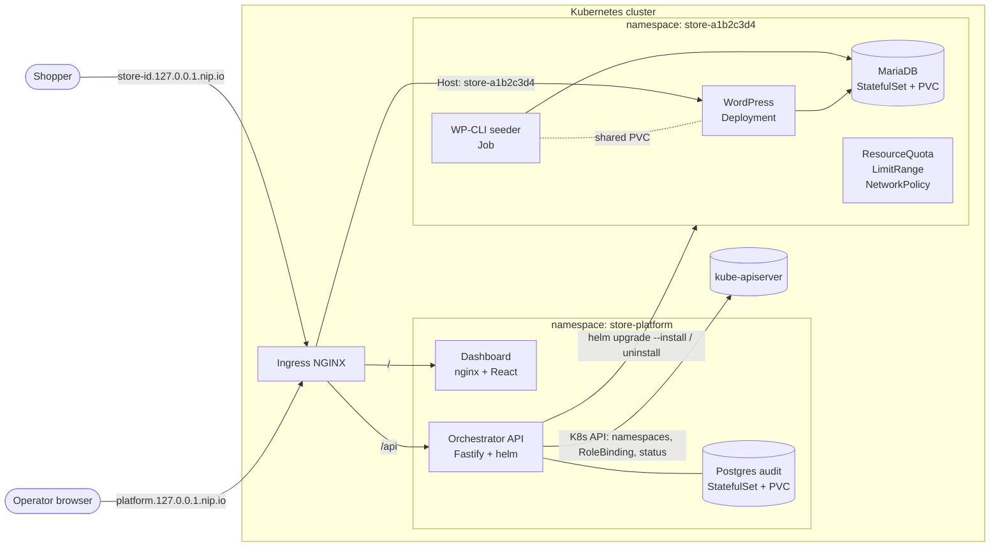
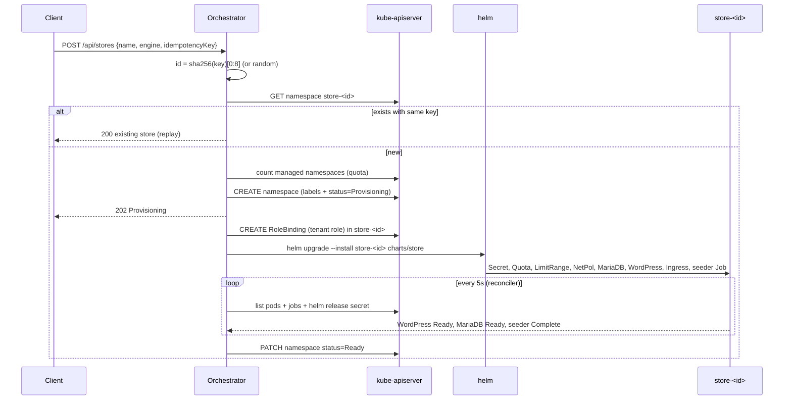

# System Design

## 1. Goals

- Provision an isolated, working e-commerce store on Kubernetes with one API call.
- Run identically on a laptop (Kind) and a VPS (k3s); only Helm values differ.
- Survive orchestrator crashes, retries and duplicate requests without leaking or duplicating resources.
- Keep each tenant contained: CPU, memory, storage, network and credentials.

## 2. Architecture



ASCII version:

```
             ┌──────────────────────── Ingress NGINX (host routing) ───────────────────────┐
             │ platform.<domain>/      platform.<domain>/api       store-<id>.<domain>/     │
             └──────┬─────────────────────────┬───────────────────────────┬────────────────┘
                    ▼                         ▼                           ▼
             ┌────────────┐          ┌─────────────────┐       ┌──────────── store-<id> ────────────┐
             │ Dashboard  │  fetch   │ Orchestrator API │ helm  │ WordPress ─► MariaDB (PVC)          │
             │ React/nginx│ ───────► │ Fastify          │ ────► │ WP-CLI seeder Job (shared WP PVC)   │
             └────────────┘          │  ├ StoreManager  │       │ Quota · LimitRange · NetworkPolicy  │
                                     │  ├ Reconciler    │ watch │ Secret (generated credentials)      │
                                     │  └ Audit (PG)    │ ◄──── │ Ingress store-<id>.<domain>         │
                                     └─────────────────┘       └─────────────────────────────────────┘
```

### Components

| Component | Responsibility |
|-----------|----------------|
| `charts/platform` | API Deployment, dashboard Deployment, Services, Ingress, ServiceAccount, RBAC, ValidatingAdmissionPolicy, ConfigMap. |
| `charts/store` | Everything one tenant needs. Installed once per store as release `store-<id>` in namespace `store-<id>`. |
| Orchestrator API | Validates requests, enforces platform quota and idempotency, creates the namespace and tenant RoleBinding, runs Helm, reconciles status, records the audit log. |
| Engine providers | `WooCommerceEngineProvider` (fully implemented) and `MedusaEngineProvider` (interface only). An engine knows how to install, judge health of, and remove its own workloads; everything else is platform logic. |
| Dashboard | Polls every 5 s. Create, delete with confirmation, status badges with failure reasons, activity drawer. |

### Provisioning sequence



## 3. Multi-tenant isolation

Every store is a namespace. Tenancy controls are part of the store chart, so a store cannot exist without them.

| Layer | Control | Setting (prod) |
|-------|---------|----------------|
| Naming | Namespace `store-<id>`, release `store-<id>` | id is 8 chars `[a-z0-9]` |
| Compute | `ResourceQuota` | requests 500m CPU / 512Mi, limits 1500m / 1536Mi, 2 PVCs, 6 pods, no LoadBalancer or NodePort Services |
| Defaults | `LimitRange` | default request 50m/64Mi, default limit 200m/256Mi, max 500m/512Mi per container, max 5Gi per PVC |
| Network | `NetworkPolicy` | default deny ingress; allow same-namespace pods; allow `ingress-nginx` namespace to WordPress port 80 only |
| Pod security | Namespace label `pod-security.kubernetes.io/enforce: baseline`, warn `restricted` | MariaDB and seeder run as non-root with all capabilities dropped |
| Credentials | Per-store `Secret` generated by Helm | DB root, DB user, WP admin, WP salts; never shared across stores |
| Storage | Per-store PVCs | Deleted with the namespace; StatefulSet uses `persistentVolumeClaimRetentionPolicy: Delete` |

Quota sizing is exact: MariaDB (150m/192Mi request) + WordPress (150m/192Mi) + seeder (100m/128Mi) = 400m/512Mi requests, and 1500m/1536Mi limits in prod. WordPress uses the `Recreate` strategy so an upgrade never needs two pods' worth of quota. `values-local.yaml` relaxes limits to 2 CPU / 2Gi for laptop headroom.

Kind's default CNI (kindnet) enforces NetworkPolicy from Kind v0.24. k3s enforces it with its embedded kube-router controller.

## 4. Reliability and idempotency

### Kubernetes is the database

Store state lives on the namespace:

| Key | Kind | Purpose |
|-----|------|---------|
| `platform.io/managed=true` | label | Discovery |
| `platform.io/store-id`, `platform.io/engine` | label | Identity |
| `platform.io/store-name` | annotation | Display name |
| `platform.io/status`, `platform.io/reason` | annotation | Lifecycle state |
| `platform.io/created-at`, `platform.io/ready-at` | annotation | Timestamps and timeout base |
| `platform.io/idempotency-key-sha256` | annotation | Replay detection |

The orchestrator process holds no authoritative state. It can be killed at any moment and a new process continues from the cluster. The only other state is the audit log in the platform's Postgres StatefulSet, shared by all API replicas.

### Idempotent create

- With `idempotencyKey`, the store id is `sha256(key)[0:8]`. Two concurrent requests with the same key, even on different API replicas, race to create the same namespace name. Kubernetes accepts exactly one; the loser gets 409, re-reads the namespace and returns it as a replay.
- A replay with the same key but a different body returns 422. A replay while the store is deleting returns 409.
- The dashboard generates one key per modal session with `crypto.getRandomValues`, so double clicks and network retries produce one store.
- Inside one process, a mutex serialises the quota check and namespace creation.

### Idempotent provisioning

- Helm runs `upgrade --install`, which converges whether the release is missing, half installed or current.
- The store Secret uses `lookup` to reuse existing values, so an upgrade never rotates the MariaDB password away from the data on disk.
- The seeder Job checks state before every step (`core is-installed`, `plugin is-installed`, `plugin is-active`, product exists). A retried Job (`backoffLimit: 4`) resumes instead of failing on "already exists".

### Reconciliation loop

Every 5 seconds (no overlapping passes) the reconciler lists managed namespaces and for each store:

| Condition | Action |
|-----------|--------|
| status `Deleting` or namespace `Terminating` | Start or resume teardown |
| `Provisioning`, no Helm release, no install running in this process | Crash recovery: resume the install (audit `STORE_PROVISIONING_RESUMED`) |
| WordPress Ready + MariaDB Ready + seeder Complete | `Ready` |
| Seeder Job `Failed`, image pull errors, config errors, CrashLoopBackOff with ≥3 restarts | `Failed` with reason |
| Still progressing after 300 s | `Failed: Provisioning timed out after 300s (waiting for …)` |
| `Failed` store later becomes healthy | `Ready` (audit `STORE_RECOVERED`) |

A `HelmError` caused by the release lock ("another operation is in progress") is not a failure; the next pass retries. Concurrent Helm installs are capped by a semaphore (`MAX_CONCURRENT_PROVISIONS`, default 3) so a burst of creates cannot starve the node or the API server.

### Clean teardown

1. Mark the namespace `Deleting` (visible immediately in the UI).
2. Wait for any in-flight install for that store to finish.
3. `helm uninstall store-<id> --wait`: removes Deployments, StatefulSet, Services, Ingress, Job, ConfigMap, Secret, WordPress PVC.
4. Delete the namespace with `propagationPolicy: Foreground`: removes the MariaDB PVC, the tenant RoleBinding, Helm release Secrets and anything created out of band.
5. Poll until the namespace is gone, then audit `STORE_DELETED`.

The store chart contains no cluster-scoped objects (no ClusterRoles, no PVs with `Retain`), so namespace deletion is complete by construction. The local-path provisioner deletes the backing PVs (`reclaimPolicy: Delete`). `verify-e2e.sh` asserts that no PV still references the namespace.

If teardown fails, it is audited as `STORE_DELETE_FAILED` and the reconciler retries on the next pass because the status is still `Deleting`.

### Helm upgrade safety

- The platform chart and store chart are upgraded with `helm upgrade --install`; `--history-max 5` bounds release Secrets.
- The API Deployment rolls with `maxUnavailable: 0`, so one replica always serves during a platform upgrade; the Lease moves to a healthy replica if the leader is replaced. (With `audit.backend=sqlite` it falls back to `Recreate`, because the SQLite PVC is RWO.) `checksum/config` and `checksum/users` annotations restart pods when configuration or users change.
- Store upgrades (for example a new WordPress image) re-render with the looked-up Secret values and roll WordPress with `Recreate`. Data lives on PVCs and survives.
- The seeder Job is named `store-<id>-seeder-r<revision>`. Job pod templates are immutable, so a fixed name would make every `helm upgrade` fail. Each upgrade or rollback runs a fresh, idempotent seeder that moves plugin, theme and core versions and runs database migrations. Catalog content is seeded only once, so merchant edits are kept.
- `scripts/upgrade-stores.sh` upgrades stores one at a time: backup, `helm upgrade --reset-then-reuse-values`, wait for the seeder, smoke test, automatic `helm rollback` plus data restore on failure. See the runbook in the README.

## 4b. Observability

- The dashboard shows an activity drawer (audit trail) and summary cards: stores created, success rate, failures, average and p95 provisioning time, deletions.
- `GET /metrics` exposes Prometheus metrics on the API pod only (not routed by the Ingress): store counts by status, lifecycle event totals, provisioning duration and helm operation duration histograms.
- Totals derive from the Postgres audit log rather than in-memory counters, so they survive restarts and agree across API replicas.
- Failures carry a human-readable reason (seeder Job failure message, image pull or CrashLoopBackOff pod state, or a timeout listing what was still pending), shown in the Failed badge popover.

## 5. Security

### Authentication and per-user quotas

- The platform chart renders a `store-platform-auth` Secret with one random 40-character token per user in `auth.users`. Tokens are generated on first install and kept on upgrade (`lookup`), so they never appear in source or values files.
- The API hashes tokens with SHA-256 at startup and compares with `timingSafeEqual` against every user, so response time does not reveal which user matched.
- Every store carries a `platform.io/owner` label. `list`, `get`, `delete`, `domains` and `audit` are filtered by owner; a store owned by someone else returns 404, not 403, so ids cannot be probed.
- Quotas: `maxStores` per user and `orchestrator.maxStores` for the platform, both checked inside the global create lock.

### Exposure: public versus internal-only

| Surface | Reachable from | How |
|---------|----------------|-----|
| Dashboard (`/`) | Public, through Ingress NGINX | `platform.<domain>`; static files only |
| Orchestrator API (`/api/*`, `/healthz`) | Public, through Ingress NGINX | Same host as the dashboard; every `/api/*` call needs a per-user bearer token; rate limited per user; schema validated |
| Storefront and `/wp-admin` | Public, through Ingress NGINX | `store-<id>.<domain>`; WordPress login protects admin |
| `/metrics`, `/readyz` | Cluster-internal only | Not routed by the Ingress; `/metrics` through Ingress returns the dashboard HTML |
| MariaDB (3306) | Its own store namespace only | ClusterIP Service + NetworkPolicy; verified that a pod in another namespace cannot connect |
| WordPress pod (80) | Ingress controller and its own namespace only | NetworkPolicy allows only `ingress-nginx` and same-namespace pods |
| Kubernetes API | Orchestrator ServiceAccount only | RBAC + ValidatingAdmissionPolicy below; no other store pod mounts a token |
| Store credentials | Kubernetes Secrets in the store namespace | Never returned by the API or written to logs or the audit trail |

No Service uses `NodePort` or `LoadBalancer` inside store namespaces (the ResourceQuota sets both to 0).

### RBAC least privilege

Kubernetes RBAC cannot express "namespaces whose name starts with `store-`". The platform combines three mechanisms to get that property:

1. **Cluster-scoped ClusterRole** (`store-platform-orchestrator`), bound cluster-wide. It grants only: `namespaces` get/list/watch/create/patch/delete, `rolebindings` create, and `bind` on the single ClusterRole `store-platform-tenant-manager`.
2. **Tenant ClusterRole** (`store-platform-tenant-manager`), never bound cluster-wide. After creating `store-<id>`, the orchestrator creates a RoleBinding to this role inside that namespace only. It grants the workload, Secret (including Helm release Secrets), Ingress and NetworkPolicy rights Helm needs. The orchestrator therefore cannot read Secrets or touch workloads in `kube-system`, `store-platform` or any non-store namespace.
3. **ValidatingAdmissionPolicy** (`store-platform-store-namespaces-only`), matched only to the orchestrator ServiceAccount. It denies namespace create/update/delete unless the name starts with `store-`, and RoleBinding create/update/delete outside `store-*` namespaces. This closes the gaps RBAC leaves: a compromised API pod cannot delete `kube-system` or bind the tenant role elsewhere.

Escalation check: `bind` is restricted by `resourceNames`, so the orchestrator cannot bind `cluster-admin` or any other role.

### Secret handling

- Store credentials are generated inside Helm (`randAlphaNum`) and stored only in the per-store Secret. They never pass through the API, logs or the audit trail.
- Values passed to Helm are written to a `0600` temp file on the pod-local `/tmp` `emptyDir` and deleted after the command.
- WordPress salts are per store, so session cookies cannot be replayed across stores.
- Workload pods set `automountServiceAccountToken: false`; only the API pod mounts a token.

### Container security context

| Pod | runAsNonRoot | readOnlyRootFilesystem | Capabilities |
|-----|--------------|------------------------|--------------|
| Orchestrator API | yes (uid 1000) | yes (`/tmp`, `/data` volumes) | drop ALL |
| Dashboard | yes (uid 101, nginx-unprivileged on 8080) | yes | drop ALL |
| MariaDB | yes (uid 999) | no (writes datadir) | drop ALL |
| WP-CLI seeder | yes (uid 33) | no | drop ALL |
| WordPress | root entrypoint, Apache workers as `www-data` | no | drop ALL, add only CHOWN, DAC_OVERRIDE, FOWNER, SETGID, SETUID, NET_BIND_SERVICE, KILL |

All pods use `seccompProfile: RuntimeDefault` and `allowPrivilegeEscalation: false`. The official WordPress image must start as root to populate the volume and bind port 80; the capability set above is the minimum that allows this and fits the `baseline` Pod Security Standard. A fully non-root WordPress needs a custom image listening on 8080.

### API hardening

- JSON schema validation on every body, param and query; `additionalProperties: false`; 16 KiB body limit.
- Store names are restricted to `[A-Za-z0-9 _.-]`, ids to `[a-z0-9]{3,20}`, so no user input reaches a shell or a Kubernetes name unchecked. Helm is spawned with an argument array, never a shell string.
- Rate limit on POST, PUT and DELETE (30/min by default), keyed per authenticated user.
- `trustProxy` so audit entries record the real client IP from Ingress NGINX.

## 6. Scaling and abuse prevention

### Admission controls

| Control | Where | Default |
|---------|-------|---------|
| Max active stores | API, counted from namespaces | 10 → `429 STORE_QUOTA_EXCEEDED` |
| Max stores per user | API, counted from `platform.io/owner` labels | `admin` 10, `demo` 2 → `429 USER_QUOTA_EXCEEDED` |
| Custom domains per store | API | 3; platform domains reserved; one store per domain |
| Mutation rate limit | API, per client IP | 30 POST/DELETE per minute |
| Concurrent installs | API semaphore | 3 |
| Per-store resources | ResourceQuota + LimitRange | see section 3 |
| Provisioning timeout | Reconciler | 300 s |
| Seeder runtime | Job `activeDeadlineSeconds` | 900 s |

### Scaling the orchestrator horizontally

Implemented and running by default with 2 API and 2 dashboard replicas:

- **Stateless request path:** store state lives in namespace annotations, so any replica can answer any request.
- **Shared audit log:** Postgres (`audit.backend=postgres`) replaces per-pod SQLite. Writes are queued per replica and never block a request.
- **Single writer for the cluster:** a `coordination.k8s.io` Lease (`store-platform-reconciler`, 15 s) elects one replica to run the reconciler, Helm installs and teardowns. Replicas that are not leader only record intent (namespace with status Provisioning or Deleting); the leader picks it up within one reconcile interval. A replica that loses the lease stops acting once its own lease could have expired, and `replaceNamespacedLease` uses the resourceVersion, so two replicas cannot both take over.
- **Atomic quotas across replicas:** `pg_advisory_lock` wraps "count stores, check platform and user quota, create namespace". A `ResourceQuota` cannot count namespaces because they are cluster scoped.
- **Idempotency across replicas:** the store id is derived from the user and the idempotency key, so a retried create that lands on another replica collides on the namespace name.
- **Provisioning throughput:** the leader caps concurrent Helm installs (`maxConcurrentProvisions`). To go past one leader's throughput, shard by store id across several Leases, or move to an operator with a work queue.
- **Autoscaling:** `values-prod.yaml` enables an HPA on API CPU (2–5 replicas); PodDisruptionBudgets keep at least one API and one dashboard pod during node drains.
- **Known limit:** the rate limiter is in memory per replica, so the effective limit is per replica. A Redis store for `@fastify/rate-limit` would make it global.

### Scaling stores

- One VPS node fits about 10 stores at the prod quota (≈ 5 CPU / 5 Gi requests with platform overhead).
- Multiple nodes: nothing in the charts is node-specific except `local-path` storage, which pins a store to the node holding its PVCs. Use a network storage class (Longhorn, a cloud CSI driver) for rescheduling across nodes.
- Very large fleets: replace one-namespace-per-store Helm releases with an operator (a `Store` CRD reconciled by controller-runtime) to avoid spawning Helm per store.

## 7. Local versus VPS / cloud

| Concern | Local (Kind) | VPS (k3s) | Managed cloud |
|---------|--------------|-----------|---------------|
| DNS | `*.127.0.0.1.nip.io` wildcard, zero config; `*.localhost` alias for browsers that block nip.io | `A *.stores.example.com → VPS IP` | Wildcard record to the load balancer, often via external-dns |
| Ingress | Ingress NGINX Kind manifest, `hostPort` 80/443 on the control-plane node | Ingress NGINX with k3s ServiceLB (Traefik disabled) | Ingress NGINX or the cloud L7 controller behind a cloud LoadBalancer |
| TLS | Off (`tls: false`) | cert-manager + Let's Encrypt `ClusterIssuer: letsencrypt-prod`, HTTP-01 per store host | DNS-01 wildcard certificate to avoid per-host rate limits |
| Storage | Kind `standard` (local-path) | k3s `local-path`, data on the VPS disk, back it up | Block storage CSI (gp3, pd-balanced) with snapshots |
| NetworkPolicy | kindnet (Kind ≥ 0.24) | kube-router (built into k3s) | Calico or Cilium |
| Images | Built locally and `kind load`ed; store images pre-pulled | Pulled from a registry | Registry with pull-through cache |
| Resource profile | `values-local.yaml`: relaxed limits | `values-prod.yaml`: strict quota | `values-prod.yaml` plus node autoscaling |
| Custom domains | `/etc/hosts` entry to 127.0.0.1 | Customer creates `A → VPS IP`; cert-manager issues `store-<id>-custom-tls` | CNAME to the load balancer hostname (`publicIngressHostname`) |
| Platform install | `make setup && make deploy` (local image build) | `scripts/install-vps.sh` with GHCR images built by GitHub Actions | Same chart with a registry and managed database values |
| Redirects | HTTP only, `WP_HOME=http://…` | `X-Forwarded-Proto: https` mapped to `$_SERVER['HTTPS']='on'`, `WP_HOME=https://…` | Same as VPS |

The only inputs that change between environments are `STORE_VALUES_PROFILE`, `STORE_BASE_DOMAIN`, `STORE_TLS` and the platform ingress values. The charts, images and code are the same.

## 8. MedusaJS engine

`MedusaEngineProvider` implements the same `EngineProvider` contract and is registered with `available = false`. The API rejects Medusa creates with `501 ENGINE_NOT_AVAILABLE` before touching the cluster, and the dashboard shows it as "Stubbed Demo". A real implementation adds a `charts/store-medusa` chart (Medusa backend and worker, Postgres StatefulSet, Redis, Next.js storefront, a migration and seed Job) installed into the same `store-<id>` namespace, so it inherits quota, LimitRange, NetworkPolicy, RBAC, idempotency, reconciliation and teardown without platform changes. Its readiness rule would be backend Ready + storefront Ready + seed Job Complete.

## 9. Tradeoffs

| Decision | Chosen | Alternative | Why, and what it costs |
|----------|--------|-------------|------------------------|
| Provisioning mechanism | API runs `helm upgrade --install` per store | A Kubernetes operator with a `Store` CRD | Helm is mandatory for the task, gives upgrade and rollback history per store for free, and is fast to build. Cost: spawning a helm process per store and a polling reconciler instead of watch-driven reconciliation. At hundreds of stores an operator is the better fit. |
| State storage | Namespace labels and annotations | A platform database | The API is stateless and recovers from crashes by reading the cluster. Cost: annotation size limits and no rich queries; listing stores is a namespace list call. |
| Isolation unit | Namespace per store | Shared namespace, or a vCluster/node pool per store | Namespaces give quotas, NetworkPolicies, RBAC and one-call teardown. Cost: stores share the node kernel and the cluster control plane, so this is soft multi-tenancy. |
| Database | One MariaDB StatefulSet per store | A shared managed MySQL with a schema per store | Full data isolation and clean deletion. Cost: about 150m CPU and 192Mi memory per store even when idle. |
| Store bootstrap | WP-CLI seeder Job on a shared RWO volume | A pre-baked WordPress image with WooCommerce and content | Stays on official images and pins versions through values. Cost: every new store downloads WooCommerce and Storefront (network dependency, about 20 s) and the RWO volume ties the seeder to the WordPress node. |
| Readiness | Reconciler polls every 5 s | Kubernetes watches / informers | Simple and restart-safe. Cost: status can lag by up to one interval and each pass lists namespaces. |
| Audit log | Postgres StatefulSet (SQLite still supported for one replica) | Managed database | Lets API replicas share one log and one create lock. Cost: one more stateful component to back up; a single Postgres pod is not highly available. |
| Replica coordination | Lease-based leader runs all cluster writes | Every replica reconciles, relying on Helm locks | No duplicate installs and a simple mental model. Cost: provisioning throughput is bounded by one leader until stores are sharded. |
| Global and per-user quota | `pg_advisory_lock` around count and create | Kubernetes admission webhook counting namespaces | Works with the existing API and is correct across replicas. Cost: the lock depends on Postgres being available; creates fail fast if it is not. |
| Authentication | Static per-user bearer tokens from a Helm-generated Secret | OIDC / SSO | No external identity provider needed and easy to demo. Cost: token rotation is manual and there is no self-service sign-up. |
| Custom domains | Helm upgrade adds hosts and a separate certificate | Wildcard TLS with a proxy per domain | Reuses the store chart and cert-manager. Cost: each change re-runs the (idempotent) seeder Job, and HTTP-01 needs DNS to point at the VPS before the certificate issues. |
| Idempotency key | Store id derived from `sha256(key)` | Stored key-to-id table | Kubernetes name uniqueness makes duplicates impossible even across replicas. Cost: an 8-character id space per key, which is ample for this scale. |
| Local domain | `*.127.0.0.1.nip.io` plus `*.localhost` alias | `/etc/hosts` entries or a local DNS server | No machine changes. Cost: depends on public DNS for nip.io, which some networks and embedded browsers block, hence the alias. |
| Catalog content | Built-in store types, keyword detection and custom product lists, with generated images | Real product imports or AI-generated catalogs | Deterministic, offline and fast. Cost: product images are generated placeholders, and detection only knows 19 store types. |
| Upgrades | Revision-named seeder Job, content seeded once, sequential canary script with auto-rollback | Blue/green store copies | Keeps merchant data in place and limits a bad release to one store. Cost: `helm rollback` does not undo database migrations; the script restores the backup for that. |
| Engine scope | WooCommerce complete, MedusaJS behind the same interface | Both engines partially | One engine passes the end-to-end order test fully, and the interface shows where the second plugs in. |
