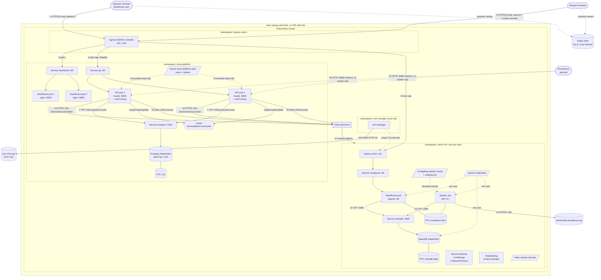
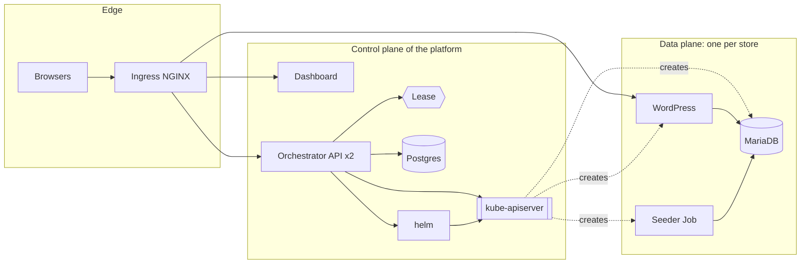
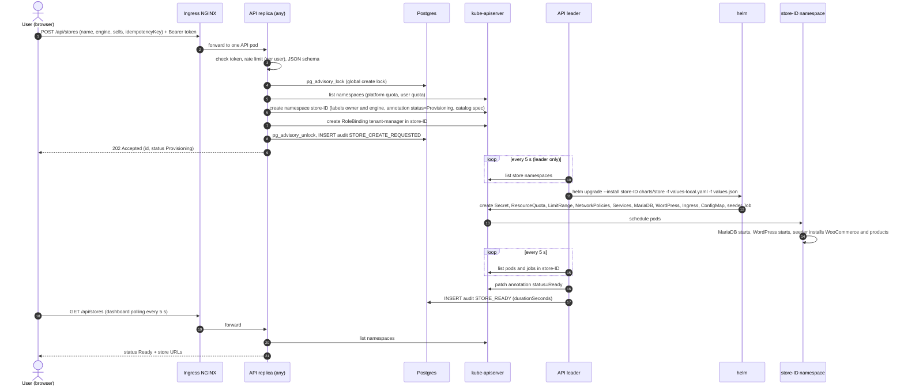
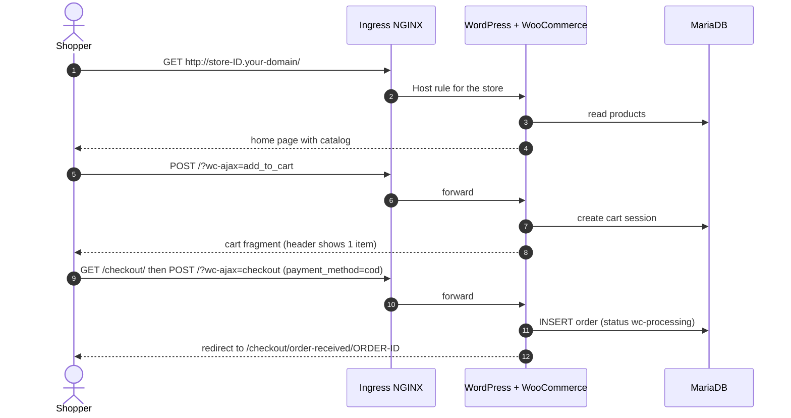
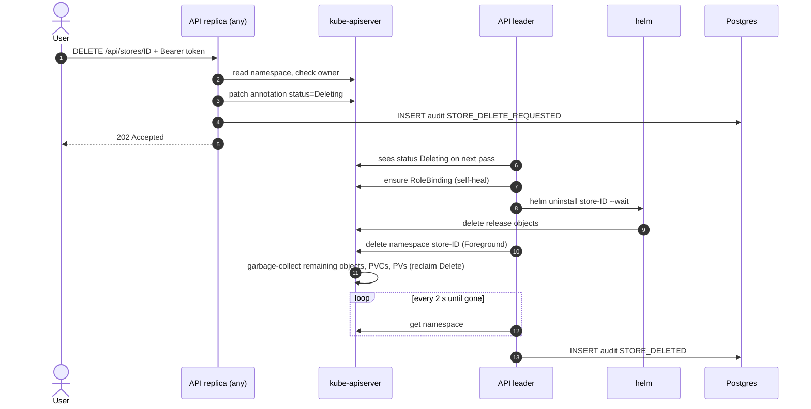
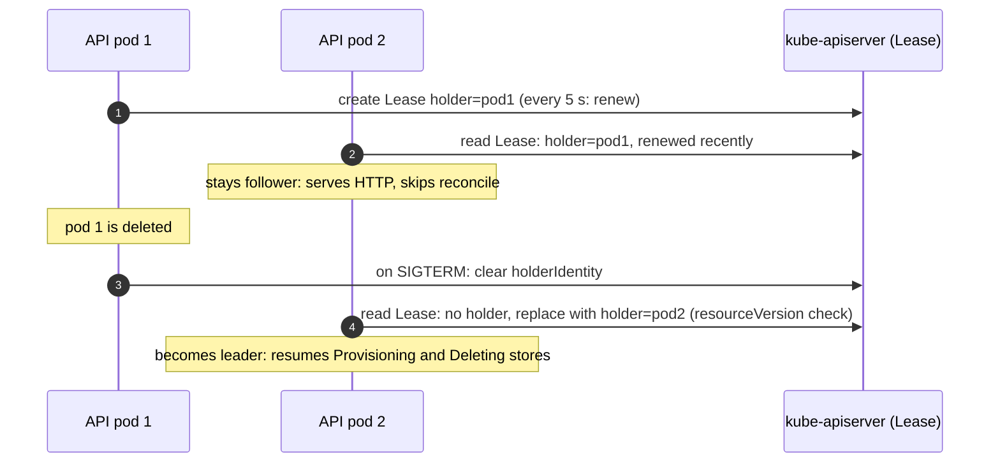
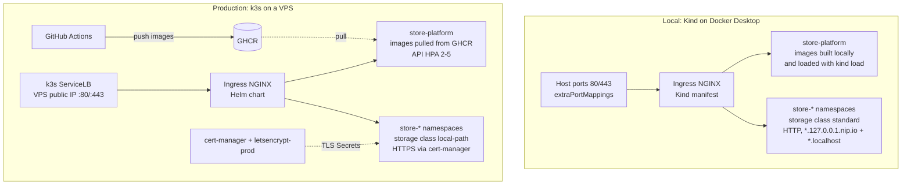

# Architecture

This document shows every component of the store provisioning platform and exactly how the components talk to each other: who calls whom, over which protocol and port, with which credentials, and what restricts the connection.

GitHub renders the Mermaid diagrams. An ASCII version of the main diagram is at the end for viewers without Mermaid.

---

## 1. Component diagram



---

## 2. Every connection, explained

| # | From | To | Protocol / port | Credentials | Purpose | Restricted by |
|---|------|----|-----------------|-------------|---------|---------------|
| 1 | Operator browser | Ingress NGINX | HTTP :80 locally, HTTPS :443 in prod | none at this hop | Load the dashboard and call the API | Host rule `platform.<domain>` (+ `platform.localhost` locally) |
| 2 | Shopper browser | Ingress NGINX | HTTP / HTTPS | none | Visit a storefront, cart, checkout, wp-admin | Host rules `store-<id>.<domain>`, `store-<id>.localhost`, attached custom domains |
| 3 | Ingress NGINX | Dashboard Service :80 → pods :8080 | HTTP | none | Serve the React build (static files) | Path `/` on the platform host |
| 4 | Ingress NGINX | API Service :80 → pods :8080 | HTTP | `Authorization: Bearer <token>` from the browser, checked by the API | Every dashboard action | Paths `/api` and `/healthz` only; `/metrics` and `/readyz` are not routed |
| 5 | Ingress NGINX | Store Ingress → WordPress Service :80 → pod :80 | HTTP (TLS ends at the Ingress in prod) | WordPress login for wp-admin | Storefront traffic | NetworkPolicy allows only the `ingress-nginx` namespace to WordPress port 80 |
| 6 | API pods | kube-apiserver | HTTPS :443 | Mounted ServiceAccount token `store-platform-api` | Namespaces, RoleBindings, pods and jobs, namespace annotations (store status) | RBAC ClusterRole + per-store RoleBinding + ValidatingAdmissionPolicy (`store-` names only) |
| 7 | API pods | Postgres Service :5432 | PostgreSQL wire protocol | `PGPASSWORD` from Secret `store-platform-postgres` | Write and read the audit log; `pg_advisory_lock` around store creation | NetworkPolicy: only API pods may connect |
| 8 | API pods | Lease object (through kube-apiserver) | HTTPS :443 | Same ServiceAccount | Leader election: one replica runs the reconciler, installs and teardowns | Role `leader-election` (Leases in `store-platform` only) |
| 9 | Secret `store-platform-auth` | API pods | Volume mount `/etc/platform-auth` | Kubernetes | Users, roles, store quotas, tokens | API hashes tokens with SHA-256 in memory |
| 10 | API pods (`helm` child process) | kube-apiserver | HTTPS :443 | Same ServiceAccount token | `helm upgrade --install` and `helm uninstall` of the store chart bundled in the image | Tenant role granted only inside `store-<id>` through the RoleBinding |
| 11 | kube-apiserver | Store namespace | internal | — | Creates Secret, quota, limits, network policies, MariaDB, WordPress, Services, Ingress, ConfigMap, seeder Job, Helm release Secrets | ResourceQuota, LimitRange, Pod Security `baseline` label |
| 12 | WordPress pod | MariaDB Service :3306 | MySQL protocol | `WORDPRESS_DB_PASSWORD` from the store Secret | Store data: products, orders, customers | NetworkPolicy: same namespace only |
| 13 | Seeder Job | MariaDB Service :3306 | MySQL protocol (through WP-CLI / PHP) | Same store Secret | Install WordPress, configure WooCommerce and COD, create products | Same namespace only |
| 14 | Seeder Job | downloads.wordpress.org | HTTPS :443 (egress) | none | Download WooCommerce 8.9.3 and Storefront 4.6.2 | Versions pinned in chart values; egress is not restricted |
| 15 | Prometheus (optional) | API pods :8080 `/metrics` | HTTP | none | Scrape platform metrics | Only reachable inside the cluster; Service carries `prometheus.io/scrape` annotations |
| 16 | cert-manager (prod) | Let's Encrypt | HTTPS (ACME), HTTP-01 challenge through Ingress | ACME account key in Secret `letsencrypt-prod` | Issue certificates for platform, store and custom domain hosts | Only Ingresses with the `cert-manager.io/cluster-issuer` annotation |

Other connections not drawn:

| From | To | Protocol | Purpose |
|------|----|----------|---------|
| kubelet | API pods `/healthz` (liveness), `/readyz` (readiness) | HTTP :8080 | Restart or remove unhealthy pods |
| API `/readyz` | kube-apiserver | HTTPS | Ready only when Kubernetes is reachable |
| kubelet | WordPress `/wp-login.php`, MariaDB `mysqladmin ping`, Postgres `pg_isready` | HTTP / exec | Store and database probes |
| API | DNS resolver | DNS | "Check DNS" for custom domains |
| API replica | API replica | — | **No direct communication.** They coordinate only through the Lease, the Postgres advisory lock and namespace annotations. |
| Dashboard pods | API | — | **No server-side call.** The browser calls the API; the dashboard pods only serve static files. |

---

## 3. What talks to what, by layer



- **Control plane:** the dashboard, the API, Postgres and the Lease decide what should exist. They never sit in the path of shopper traffic.
- **Data plane:** WordPress, MariaDB and the seeder run the stores. A store keeps serving shoppers even if every platform pod is down.
- **The Kubernetes API is the only bridge** between the two planes. The orchestrator never connects to a store's database or WordPress directly; it only creates, inspects and deletes Kubernetes objects.

---

## 4. Request flows

### 4.1 Create a store



### 4.2 Place an order



The platform API is not involved at all: orders are pure data plane traffic.

### 4.3 Delete a store



### 4.4 Leader election and failover



If pod 1 dies without releasing the Lease, pod 2 takes over once the renew time is older than 15 seconds. Two pods cannot both take over: the update carries the Lease `resourceVersion`, so Kubernetes accepts only one and returns 409 to the other.

---

## 5. Deployment topology: local versus VPS



| Aspect | Local | VPS |
|--------|-------|-----|
| Entry point | Docker maps host 80/443 to the Kind node | k3s ServiceLB binds the VPS IP |
| Names | `*.127.0.0.1.nip.io`, `*.localhost` | `platform.<domain>`, `*.stores.<domain>`, custom domains |
| TLS | none | cert-manager, Let's Encrypt HTTP-01 |
| Images | built by `make deploy`, `kind load` | built by CI, pulled from GHCR |
| Storage | `standard` (local path in the Kind node) | `local-path` on the VPS disk |
| Install | `make setup && make deploy` | `scripts/install-vps.sh` |

---

## 6. ASCII version of the main diagram

```
                     Operator browser                     Shopper browser
                            │  HTTP(S) Host: platform.*          │  HTTP(S) Host: store-<id>.* / custom domain
                            ▼                                    ▼
  ┌──────────────────────────────── Ingress NGINX (namespace ingress-nginx) ───────────────────────────────┐
  │   /  ──────────────┐        /api, /healthz ───────────┐            Host store-<id> ──────────┐           │
  └────────────────────┼──────────────────────────────────┼─────────────────────────────────────┼───────────┘
                       ▼                                  ▼                                     ▼
  ┌──────────────── namespace store-platform ──────────────────────────────┐   ┌──── namespace store-<id> (one per store) ────┐
  │  Dashboard x2 (nginx :8080)          API x2 (Fastify :8080 + helm)      │   │  Ingress ─► WordPress :80 ──► MariaDB :3306   │
  │   static files only                   │      │        │        │         │   │               │ PVC            │ PVC          │
  │                                       │      │        │        │         │   │  Seeder Job ──┴────────────────┘              │
  │     Secret auth (tokens) ─ mounted ──►│      │        │        │         │   │     │ ConfigMap scripts + catalog.json        │
  │                                       │      │        │        ▼         │   │     └─► HTTPS downloads.wordpress.org         │
  │                         TCP :5432 ◄───┘      │        │   Lease          │   │  Secret credentials (DB, admin, salts)        │
  │                  Postgres (audit, lock)      │        │  (leader)        │   │  ResourceQuota · LimitRange · NetworkPolicy×3 │
  │                         │ PVC                │        │                  │   │  RoleBinding tenant-manager · Helm secrets    │
  └──────────────────────────────────────────────┼────────┼──────────────────┘   └───────────────────────▲───────────────────────┘
                                                 │ HTTPS  │ helm (child process)                         │
                                                 ▼ :443   ▼                                              │ creates / inspects /
                                        ┌──────────────── kube-apiserver ─────────────────┐──────────────┘ deletes objects
                                        │ RBAC · ValidatingAdmissionPolicy (store-* only) │
                                        └─────────────────────────────────────────────────┘
```

---

## 7. Where each piece is defined

| Component | Source |
|-----------|--------|
| Dashboard | `platform/frontend/`, deployed by `charts/platform/templates/dashboard-deployment.yaml` |
| Orchestrator API | `platform/backend/src/`, deployed by `charts/platform/templates/api-deployment.yaml` |
| Postgres | `charts/platform/templates/postgres.yaml` |
| Users and tokens | `charts/platform/templates/auth-secret.yaml` |
| RBAC, Lease role, admission policy | `charts/platform/templates/rbac.yaml` |
| PDBs and HPA | `charts/platform/templates/scaling.yaml` |
| Platform Ingress | `charts/platform/templates/ingress.yaml` |
| Store resources | `charts/store/templates/` |
| Seeder logic | `charts/store/files/seed.sh`, `charts/store/files/seed-store.php` |
| Local vs prod values | `charts/store/values-local.yaml`, `values-prod.yaml`, `charts/platform/values.yaml`, `values-prod.yaml` |
| Cluster setup | `scripts/setup-cluster.sh` (local), `scripts/install-vps.sh` (VPS) |
| CI and images | `.github/workflows/ci.yml` |
